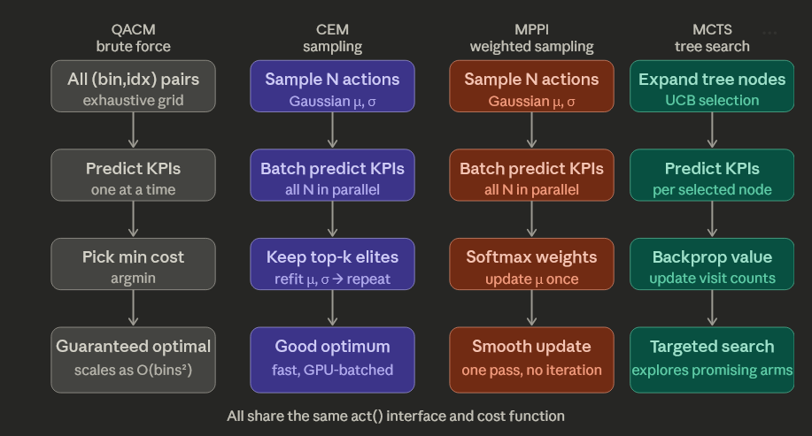

# CDD O-RAN: Causal Discovery-Driven Model-Based Planning for xApp Conflict Mitigation in O-RAN

This repository contains the framework for resolving configuration conflicts between multiple xApps in the Near-Real-Time RIC of an O-RAN architecture. The framework leverages **Causal Discovery Learning (CDL)** to detect direct, indirect, and implicit conflicts and **Model-Based Planning Algorithms** to dynamically resolve them while optimizing for multiple Key Performance Indicators (KPIs).



## Overview

In an Open RAN ecosystem, multiple xApps can concurrently subscribe to and manipulate shared network parameters, leading to configuration conflicts. This framework evaluates several model-based algorithms to find a Pareto-optimal configuration that satisfies the thresholds of all conflicting xApps simultaneously.

### Key Components

- **`Environment/`**: Houses the O-RAN simulation environments.
  - `Environment_I.py`: Replicates a standard 4-xApp scenario from literature (*Toward Control and Coordination in Cognitive Autonomous Networks*).
  - `Environment_II.py`: A more complex 5-xApp, 6-KPI extended environment designed for rigorous algorithm evaluation.
- **`Algorithms/`**: Implementations of various conflict resolution and parameter selection algorithms. Supported planners include:
  - **QACM**: Q-Learning based Action Selection for Conflict Mitigation.
  - **Model-Based CEM**: Cross-Entropy Method for iterative sampling.
  - **Model-Based MPPI**: Model Predictive Path Integral planning using soft-weighted trajectories.
  - **Model-Based MCTS**: Monte Carlo Tree Search for structured exploration.
  *(To add new algorithms, implement the `act` interface and register them in `Algorithms/__init__.py`'s `get_algorithms()` function).*
- **`Models/`**: Contains the learning architectures, primarily the CDL (Causal Discovery Learning) model used to infer the causal dependency graph between O-RAN parameters and KPIs, and the environment transition models.
- **`Parameters/`**: Centralized simulation parameters. Edit `Parameters/__init__.py` to tweak environments, algorithmic hyperparameters, simulation steps, and more.
- **`DATA/`, `Tests/`, `runs/`, `rslts/`**: Directories dedicated to data storage, unit tests, TensorBoard logs, and evaluation results.

## Execution

The project provides two main entry points depending on whether you are training the generative models or evaluating the conflict mitigation algorithms.

### 1. Training the Models
To train the CDL components and state-transition models, run:
```bash
python main.py
```
This script handles the environment interaction loop to gather data and trains the models to accurately predict next-state KPIs and the causal graph.

### 2. Evaluating Conflict Resolution Algorithms
To test the parameter selection algorithms against simulated conflicts:
```bash
python evaluate_algorithms.py
```
This script runs a continuous loop over the environment. For each step:
1. It uses the learned CDL module to detect active conflict edges.
2. It prompts every registered algorithm in `Algorithms/` to propose a resolution (action).
3. It evaluates the utility of each algorithm's proposal.
4. It logs the utility distributions and conflict resolutions directly to TensorBoard for easy comparison.

To visualize the evaluation metrics, run TensorBoard in the project root:
```bash
tensorboard --logdir runs/
```

## Setup & Dependencies
This project uses **`uv`** for extremely fast and robust dependency management. 

If you do not have `uv` installed, you can install it using PowerShell:
```powershell
powershell -ExecutionPolicy ByPass -c "irm https://astral.sh/uv/install.ps1 | iex"
```

Once installed, simply sync the environment:
```bash
uv sync
```

## Visualizing the Causal Graph
You can visualize the learned Conditional Mutual Information (CMI) heatmap and the inferred Causal Graph by running the `visualize.py` script.

```bash
python visualize.py
```
*Note: This script requires `IS_TRAIN` to be set to `False` and `USE_MLP` to be `False` in your `Parameters/__init__.py` configuration, as only the CDL/CMI model produces a causal graph.*
